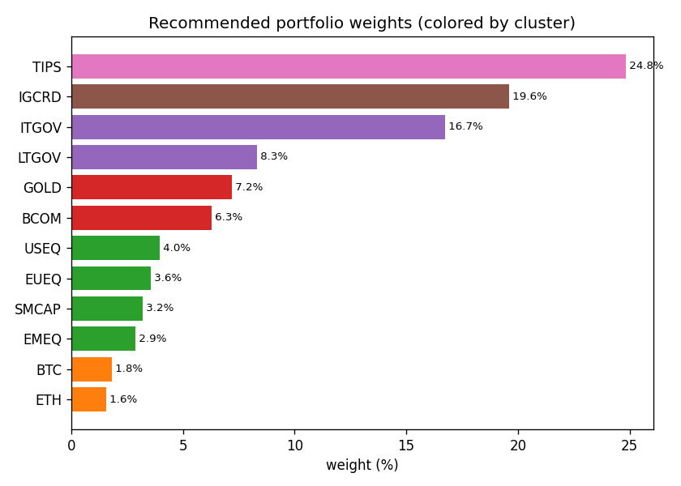
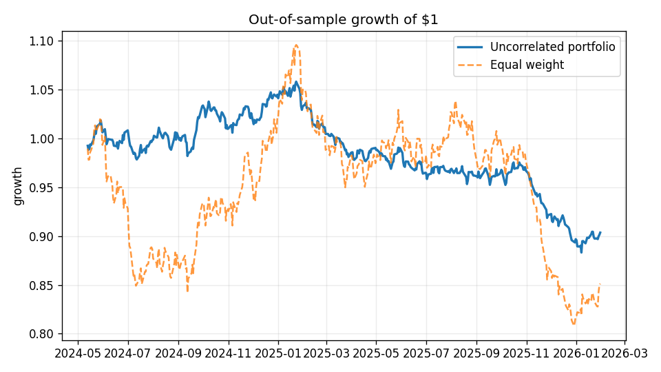
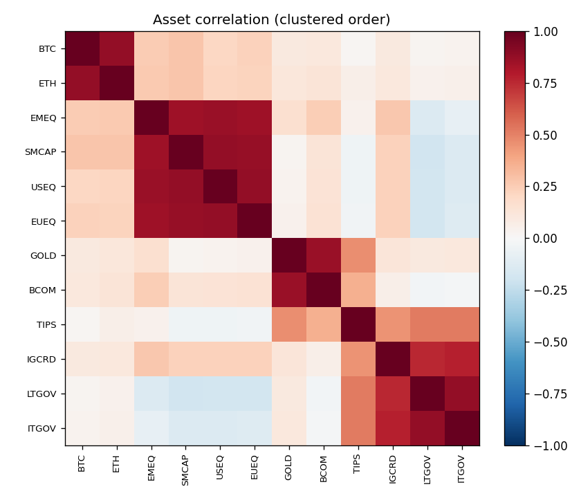

# Uncorrelated Returns — Portfolio Construction

[](https://www.python.org/downloads/)
[](LICENSE)
[](tests/)

Build portfolios from **uncorrelated return streams** — the idea that combining
several independent sources of return improves risk-adjusted performance far
more than picking any single one. The pipeline groups a multi-asset universe
into correlation clusters, then weights so that each *cluster* contributes
equally to total risk.

🔗 **Showcase:** https://andreaisabelmontana.github.io/dalio-uncorrelated-returns-rebuild/

> Built from scratch to explore correlation-distance clustering, the two-level
> inverse-vol + risk-parity weighting scheme, and out-of-sample portfolio
> evaluation — runs fully offline on deterministic synthetic data.

---

## What it does

```
universe → prices → returns → correlation clustering
        → inverse-vol weights WITHIN clusters
        → risk-parity weights ACROSS clusters
        → out-of-sample evaluation vs equal-weight
```

1. **Universe** — a 12-asset, multi-bucket set (equities by region, govt bonds,
   credit, gold, broad commodities, inflation-linked, crypto).
2. **Cluster** — build a correlation matrix, convert to a distance
   `d = √(½(1−ρ))`, run hierarchical clustering, and pick *k* by silhouette.
3. **Weight** — inverse-volatility *within* each cluster, then **risk parity**
   *across* clusters so no single theme dominates the portfolio's risk.
4. **Evaluate** — learn weights on a training window, measure return, vol,
   Sharpe, max drawdown and the diversification ratio on a held-out window.

## Results (synthetic universe, out-of-sample)

| Metric | Uncorrelated portfolio | Equal weight |
|--------|-----------------------:|-------------:|
| Annual vol | **6.65%** | 15.31% |
| Max drawdown | **−16.5%** | −26.2% |
| Diversification ratio | **1.83** | — |

The risk-parity portfolio more than **halves volatility** and shaves ~10pts off
the worst drawdown, exactly what combining uncorrelated streams should do.

<p align="center">
  
  
</p>
<p align="center"></p>

## Quick start

```bash
pip install -e ".[dev]"
uncorrelated                       # print clusters, weights, performance
uncorrelated --plots docs          # also write heatmap / weights / equity PNGs
python examples/run_demo.py
```

Use real market data instead of the synthetic universe:

```bash
pip install -e ".[live]"
uncorrelated --source live
```

```python
from uncorrelated import PortfolioCreator
result = PortfolioCreator(source="synthetic").run()
print(result.weights)              # final per-asset weights (sum to 1)
print(result.test_perf.as_dict())  # out-of-sample metrics
```

## Layout

```
uncorrelated/
  data.py        synthetic factor-driven universe (+ optional yfinance)
  returns.py     returns, annualization, covariance
  clustering.py  correlation distance, hierarchical clustering, silhouette-k
  weights.py     inverse-vol (intra) + risk parity (inter) via SLSQP
  metrics.py     return / vol / Sharpe / drawdown / diversification ratio
  portfolio.py   PortfolioCreator — the train/test pipeline
  plots.py       heatmap · weight bars · equity curve
  cli.py
```

## Why risk parity?

Equal-dollar weights let the most volatile assets dominate the portfolio's
risk. Risk parity instead solves for weights where every component's **risk
contribution** `wᵢ·(Σw)ᵢ / wᵀΣw` is equal — so a calm bond sleeve and a wild
crypto sleeve each move the needle the same amount. The test
`test_risk_parity_equalizes_risk_contributions` asserts the contributions land
within a tight band of `1/n`.

## Test

```bash
pytest -q     # 6 tests on deterministic synthetic data
```

## License

MIT — see [LICENSE](LICENSE).
